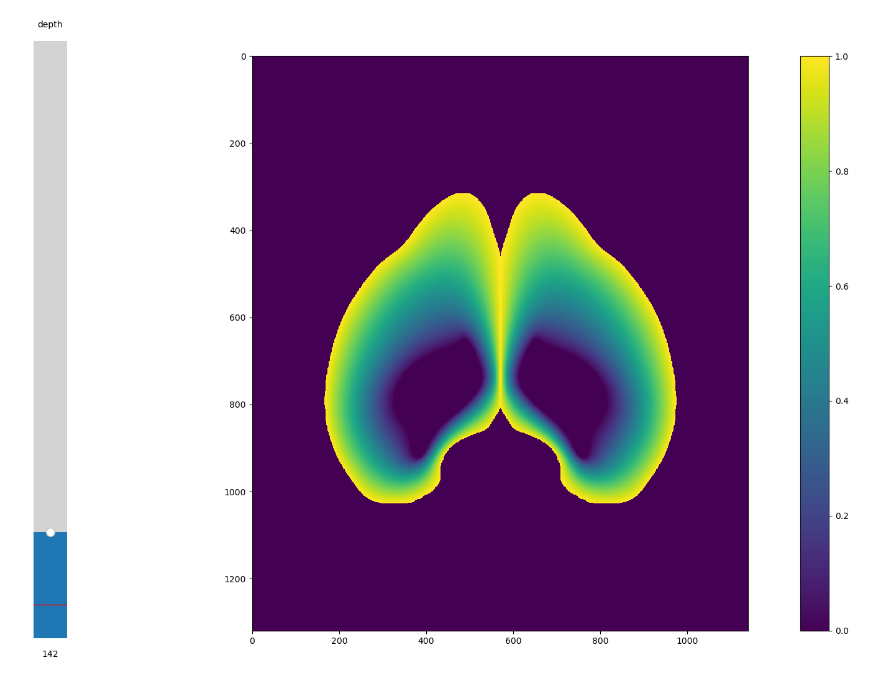

# Computing brain streamlines with the Laplacian equation

## Laplacian equation

* The directory `../ccf_2017/` should contain `isocortex_mask_10.nrrd` and `isocortex_boundary_10.nrrd`
* You need Cupy and a GPU with CUDA
* Run with `python streamlines.py`
* The uint8 mask (volume with 1=white matter, 2=gray matter, 3=in volume) will be saved in `regions/isocortex/isocortex_mask.npy`
* The laplacian will be saved in `U.npy`

